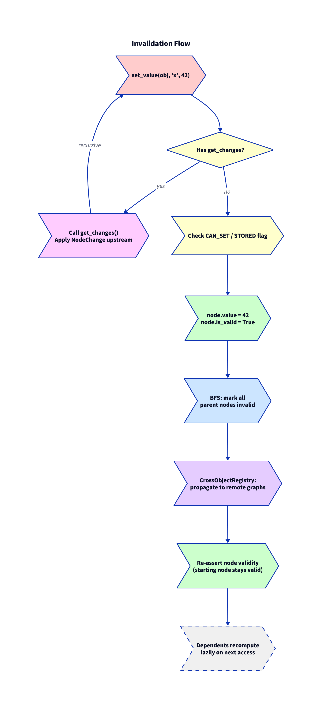
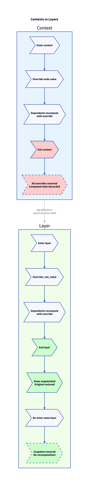

# calyxos Architecture

This document describes the system architecture of calyxos v0.2.0.

## Overview

calyxos is a reactive dependency graph computation engine for Python. It transforms methods into memoized, dependency-aware nodes that cache results, track dependencies at runtime, and selectively recompute only affected computations when inputs change.

**Core principles:**
- Zero runtime dependencies (pure Python stdlib)
- Runtime dependency tracking via method interception (no static analysis)
- Lazy invalidation with selective recomputation
- Instance-scoped graphs with cross-object edge tracking
- Scoped override contexts and persistent computation layers

## Architecture Diagram


Architecture diagrams are written in [D2](https://d2lang.com/) and located in `docs/`:

| Diagram | Source | Description |
|---------|--------|-------------|
|  | `docs/architecture.d2` | Module-level architecture — four layers (Core, Graph, Tracking, Storage) and their interactions |
|  | `docs/invalidation-flow.d2` | Step-by-step `set_value()` flow — reverse propagation, BFS invalidation, cross-object propagation |
|  | `docs/context-layer.d2` | Context vs Layer lifecycle and state management comparison |

Re-render with: `d2 docs/architecture.d2 docs/architecture.png`

## Module Responsibility Matrix

| Module | Responsibility | Stability |
|--------|---------------|-----------|
| `core/decorator.py` | `@node`, `@fn`, `@stored`, `set_value()`, `get_graph()` | Stable |
| `core/flags.py` | `NodeFlag` enum (`CAN_SET`, `CAN_OVERRIDE`, `STORED`) | Stable |
| `core/reverse.py` | `NodeChange` for bidirectional binding | Stable |
| `core/introspection.py` | `is_overridden()`, `get_node_flags()`, `is_set()` | Stable |
| `core/persistence.py` | `save_object()`, `load_object()` | Stable |
| `graph/graph.py` | `ComputationGraph` — evaluation, invalidation, context/layer stacks | Stable |
| `graph/node.py` | `Node` dataclass — value, flags, edges, get_changes_fn | Stable |
| `graph/context.py` | `GraphContext` — scoped overrides with auto-reversion | Stable |
| `graph/layer.py` | `Layer` — persistent computation snapshots | Stable |
| `graph/registry.py` | `CrossObjectRegistry` — weak-ref cross-object edges | Stable |
| `tracking/context.py` | `EvaluationFrame` stack via `contextvars` | Stable |
| `tracking/disconnect.py` | `disconnect()` — suppress dependency tracking | Stable |
| `storage/backend.py` | `StorageBackend` protocol | Stable |
| `storage/sqlite.py` | `SQLiteStorage` | Stable |
| `storage/json_storage.py` | `JSONStorage` | Stable |
| `ml/tensor_memoization.py` | `TensorMemoizer`, `BatchProcessor` | Experimental |
| `utils/debug.py` | `GraphDebugger` | Stable |
| `utils/profiler.py` | `Profiler` | Experimental |
| `utils/distributed.py` | `DistributedExecutor` | Experimental |
| `utils/gradient_tracking.py` | `GradientTracker` | Experimental |

## Key Interactions

### 1. Node Evaluation

```
User calls obj.method()
  → @node wrapper
    → get_graph(obj) → ComputationGraph
    → graph.evaluate_node(node)
      → Check context/layer overrides (_get_active_override)
      → If valid: return cached value
      → If invalid:
        → push_frame() onto EvaluationFrame stack
        → Execute compute_fn()
          → Nested node calls record_node_access()
        → pop_frame()
        → Extract dependencies from frame.accessed_nodes
        → Register local parent edges + cross-object edges (via CrossObjectRegistry)
        → Cache result, mark valid
```

### 2. Invalidation Cascade

```
set_value(obj, name, value)
  → Check get_changes_fn → reverse propagation if present
  → Validate CAN_SET / STORED flags
  → Set node.value, mark valid
  → graph.invalidate_node()
    → Mark starting node invalid
    → BFS through node.parents (local graph)
      → Skip cross-object keys (not in self.nodes)
    → CrossObjectRegistry.get_cross_parents()
      → For each remote parent: remote_graph.invalidate_node(_visited=shared_set)
  → Re-assert starting node validity (it was just set)
```

### 3. Context Override Lifecycle

```
with graph.context() as ctx:
  → Push ContextFrame onto _context_stack
  
  ctx.override(obj, "x", 42)
    → Save (value, is_valid) in frame.saved_state
    → Set node.value = 42, mark valid
    → Invalidate dependents (parents)
  
  obj.result()  → evaluate_node checks _get_active_override first

Exit context:
  → Pop ContextFrame
  → Restore saved_state for all overridden nodes
  → Invalidate dependents of restored nodes
```

### 4. Layer Snapshot Lifecycle

```
layer = graph.layer("bump")

with layer:  (first entry)
  → Snapshot base state: _base_snapshot = {key: (value, valid) for all nodes}
  → Apply layer._overrides
  
  set_value(...) / compute ...  (mutations within layer)

Exit layer:
  → Save current state as layer._snapshot
  → Restore _base_snapshot

with layer:  (re-entry)
  → Update _base_snapshot to current state
  → Restore layer._snapshot  → all previously computed values restored
  → No recomputation needed
```

## Design Principles

1. **Only persist inputs**: `STORED` values are persisted; derived values always recompute from inputs, guaranteeing determinism.
2. **Lazy over eager**: Never recompute until a value is accessed. This avoids unnecessary work.
3. **Runtime over static**: Dependencies are discovered by execution, not declaration. The graph reflects what actually happens.
4. **Thread safety via RLock**: Each `ComputationGraph` has an `RLock`. The evaluation stack uses `contextvars` for thread locality.
5. **Weak references for cross-object**: `CrossObjectRegistry` uses `weakref` so dependent objects can be garbage collected.
