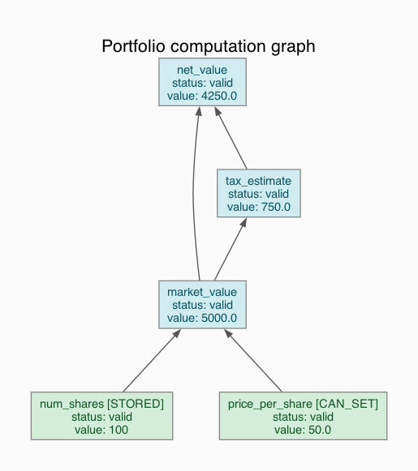
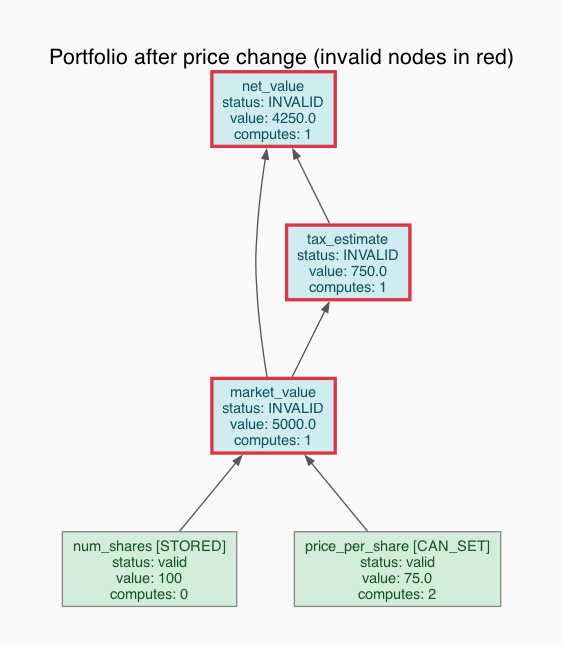
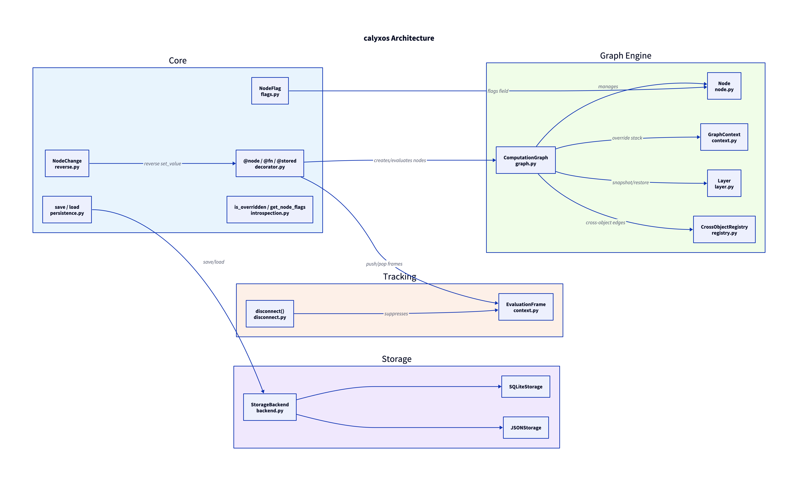

# calyxos

[](https://pypi.org/project/calyxos/)
[](https://pypi.org/project/calyxos/)
[](https://opensource.org/licenses/MIT)

**A reactive dependency graph computation engine for Python.** calyxos turns ordinary methods into memoized, dependency-aware nodes that automatically cache results, track dependencies at runtime, and selectively recompute only what changed. Inspired by Jane Street's [Incremental](https://github.com/janestreet/incremental) library, built for Python's object model.

```python
from calyxos import node, NodeFlag, set_value, get_graph

class Portfolio:
    @node(NodeFlag.STORED)
    def spot(self) -> float:
        return 100.0

    @node()
    def market_value(self) -> float:
        return self.spot() * 1000  # dependency tracked automatically

    @node()
    def tax(self) -> float:
        return self.market_value() * 0.15

p = Portfolio()
print(p.tax())          # 15000.0 — computed once, cached

set_value(p, "spot", 120.0)
print(p.tax())          # 18000.0 — only affected nodes recomputed
```

## Installation

```bash
pip install calyxos
```

From source:

```bash
git clone https://github.com/krish-shahh/calyxos.git
cd calyxos
pip install -e ".[dev]"
```

**Requirements:** Python 3.10+. Zero runtime dependencies (stdlib only).

For the interactive TUI inspector:

```bash
pip install calyxos[tui]
```

## TUI Inspector

calyxos ships with a built-in terminal UI for exploring computation graphs interactively.

**Run the demo** (benchmark + inspector):

```bash
calyxos demo
```

**Inspect your own objects** in code:

```python
from calyxos import node, NodeFlag, set_value, inspect

class MyModel:
    @node(NodeFlag.CAN_SET)
    def x(self) -> float: return 10.0

    @node()
    def result(self) -> float: return self.x() ** 2

m = MyModel()
m.result()       # compute the graph
inspect(m)       # drop into the TUI
```

**Commands** inside the TUI:

| Command | What it does |
|---------|-------------|
| `graph` | Show all nodes with status, values, flags |
| `flow` | Layered DAG view of the full graph |
| `node <name>` | Inspect a single node (deps, dependents, flags) |
| `tree <name>` | Dependency tree from a node |
| `set <name> <value>` | Set a value, shows which nodes were invalidated |
| `eval <name>` | Evaluate a node |
| `stats` | Graph statistics |
| `invalid` | List all dirty nodes |
| `quit` | Exit |

## Core Concepts

### The `@node` Decorator

The unified `@node` decorator is the primary API. Flags control behavior:

| Flag | Meaning |
|------|---------|
| *(none)* | Pure computed node. Cached, recomputed when deps change. |
| `CAN_SET` | Value can be explicitly set via `set_value()`. |
| `CAN_OVERRIDE` | Value can be temporarily overridden in a context or layer. |
| `STORED` | Persistent node (implies `CAN_SET`). Saved via storage backends. |

```python
from calyxos import node, NodeFlag

class Model:
    @node(NodeFlag.STORED)
    def learning_rate(self) -> float:
        return 0.01                          # persistent input

    @node(NodeFlag.CAN_SET, NodeFlag.CAN_OVERRIDE)
    def temperature(self) -> float:
        return 1.0                           # settable + overridable

    @node()
    def output(self) -> float:
        return self.learning_rate() * self.temperature()  # pure computed
```

The legacy `@fn` and `@stored` decorators still work. `@fn` = `@node()`, `@stored` = `@node(NodeFlag.STORED)`.

### Dependency Tracking

Dependencies are captured at runtime by recording which nodes are accessed during evaluation. No static analysis or declarations needed.

```python
class Pipeline:
    @node(NodeFlag.STORED)
    def raw_data(self) -> list:
        return [1, 2, 3]

    @node()
    def processed(self) -> list:
        return [x * 2 for x in self.raw_data()]  # dep recorded automatically

    @node()
    def summary(self) -> float:
        return sum(self.processed()) / len(self.processed())
```

### Lazy Invalidation

When a node's value changes, calyxos marks all transitive dependents as invalid but does **not** recompute them eagerly. Recomputation happens lazily on next access.

```python
set_value(pipeline, "raw_data", [10, 20, 30])
# processed and summary are now invalid, but NOT recomputed yet

pipeline.summary()  # triggers recomputation of processed, then summary
```

## What-If Analysis with Contexts

Contexts let you temporarily override node values for scenario analysis. Overrides revert automatically on exit. Contexts are nestable.

```python
model = Model()
graph = get_graph(model)

# Base case
print(model.output())  # 0.01

# Scenario: what if temperature is 2.0?
with graph.context() as ctx:
    ctx.override(model, "temperature", 2.0)
    print(model.output())  # 0.02 — dependents recompute

# Automatically reverted
print(model.output())  # 0.01

# Nested scenarios
with graph.context() as outer:
    outer.override(model, "temperature", 2.0)
    with graph.context() as inner:
        inner.override(model, "temperature", 5.0)
        print(model.output())  # 0.05
    print(model.output())  # 0.02 — inner reverted, outer still active
print(model.output())  # 0.01 — both reverted
```

## Sensitivity Analysis with Layers

Layers are like contexts but **preserve computed state** after exit. Re-entering a layer restores the cached computation without rerunning anything. This is ideal for sensitivity analysis where you bump an input, compute results, exit, then re-enter later.

```python
graph = get_graph(model)
layer = graph.layer("bump_temp")

with layer:
    set_value(model, "temperature", 2.0)
    result = model.output()  # computed once

# Base case restored
print(model.output())  # 0.01

# Re-enter: cached, no recomputation
with layer:
    print(model.output())  # 0.02 — instant, from snapshot
```

## Cross-Object Dependencies

Nodes on different objects can depend on each other. calyxos tracks these cross-object edges and propagates invalidation across object boundaries.

```python
class Market:
    @node(NodeFlag.STORED)
    def spot(self) -> float:
        return 100.0

class Instrument:
    def __init__(self, market: Market):
        self.market = market

    @node()
    def price(self) -> float:
        return self.market.spot() * 1.05  # cross-object dependency

mkt = Market()
inst = Instrument(mkt)
print(inst.price())  # 105.0

set_value(mkt, "spot", 200.0)
print(inst.price())  # 210.0 — automatically invalidated and recomputed
```

Internally, objects are tracked via weak references so they can be garbage collected normally.

## Reverse Propagation

Nodes can define a `get_changes` callback for bidirectional binding. Setting a derived node's value propagates upstream to modify the appropriate input.

```python
from calyxos import NodeChange

class Model:
    @node(NodeFlag.CAN_SET)
    def x(self) -> float:
        return 1.0

    @node(
        NodeFlag.CAN_SET,
        get_changes=lambda self, val: [NodeChange(self, "x", val / 2)]
    )
    def two_x(self) -> float:
        return self.x() * 2

m = Model()
print(m.two_x())  # 2.0

set_value(m, "two_x", 10.0)  # reverse-propagates: x = 5.0
print(m.x())      # 5.0
print(m.two_x())  # 10.0
```

## Disconnect

The `disconnect()` context manager suppresses dependency tracking. Useful for reading node values for logging or debugging without creating spurious edges.

```python
from calyxos import disconnect

class Logger:
    @node(NodeFlag.STORED)
    def data(self) -> int:
        return 42

    @node()
    def result(self) -> int:
        with disconnect():
            print(f"[log] data={self.data()}")  # no dependency created
        return 99  # independent of data
```

## Graph Visualization

Render computation graphs as images using [Graphviz](https://graphviz.org/). Install the optional dependency with `pip install calyxos[viz]`.

```python
from calyxos import GraphDebugger

dbg = GraphDebugger(model)

# Render to file
dbg.render("my_graph", directory=".", fmt="png")

# Get a graphviz.Digraph for programmatic use
dot = dbg.to_graphviz(show_values=True, show_counts=True, rankdir="BT")
dot.render("output", format="svg")
```

Node colors indicate state at a glance:

| Color | Meaning |
|-------|---------|
| Green | Stored / settable input node |
| Blue | Pure computed / derived node |
| Red border | Invalid (dirty) node |
| Gold | Currently overridden in a context or layer |

Dashed edges indicate cross-object dependencies.




Jupyter notebooks get inline SVG rendering automatically via `_repr_svg_`.

## Graph Introspection

```python
from calyxos import GraphDebugger, is_overridden, get_node_flags

dbg = GraphDebugger(model)

# Dependency tree (text)
print(dbg.dump_dependency_tree("output"))

# All nodes involved in a computation
print(dbg.list_computing_nodes("output"))

# Node status (validity, flags, override state)
print(dbg.get_node_status("temperature"))

# Check override state
print(is_overridden(model, "temperature"))

# Get flags
print(get_node_flags(model, "temperature"))
```

## Storage & Persistence

Only `@node(NodeFlag.STORED)` values are persisted. Derived values recompute from inputs on load, guaranteeing determinism.

```python
from calyxos import SQLiteStorage, JSONStorage
from calyxos.core.persistence import save_object, load_object

# SQLite
backend = SQLiteStorage("data.db")
save_object(model, backend)
load_object(model, backend)

# JSON
backend = JSONStorage("./data/")
save_object(model, backend)
```

Implement the `StorageBackend` protocol for custom backends.

## Architecture

calyxos is organized into four layers:



D2 sources live in `docs/` — re-render with `d2 docs/architecture.d2 docs/architecture.png`.

```
src/calyxos/
├── core/                    # Decorators, flags, reverse propagation
│   ├── decorator.py         # @node, @fn, @stored, set_value, get_graph
│   ├── flags.py             # NodeFlag enum (CAN_SET, CAN_OVERRIDE, STORED)
│   ├── reverse.py           # NodeChange for bidirectional binding
│   ├── introspection.py     # is_overridden, get_node_flags, etc.
│   └── persistence.py       # save/load utilities
├── graph/                   # Computation graph engine
│   ├── graph.py             # ComputationGraph (evaluation, invalidation)
│   ├── node.py              # Node dataclass (value, flags, edges)
│   ├── context.py           # GraphContext for temporary overrides
│   ├── layer.py             # Layer for persistent computation snapshots
│   └── registry.py          # CrossObjectRegistry (weak-ref tracking)
├── tracking/                # Runtime dependency tracking
│   ├── context.py           # EvaluationFrame stack (contextvars)
│   └── disconnect.py        # disconnect() context manager
├── storage/                 # Pluggable persistence backends
│   ├── backend.py           # StorageBackend protocol
│   ├── sqlite.py            # SQLiteStorage
│   └── json_storage.py      # JSONStorage
├── ml/                      # ML extensions (experimental)
│   └── tensor_memoization.py
└── utils/                   # Debugging, profiling, analysis
    ├── debug.py             # GraphDebugger
    ├── profiler.py          # Performance profiling
    ├── distributed.py       # Parallelization analysis
    └── gradient_tracking.py # Autodiff integration
```

### Key Design Decisions

- **Runtime tracking over static analysis**: Dependencies are discovered by recording node accesses during execution, not by parsing AST. This handles conditional deps, loops, and polymorphism correctly.
- **Lazy invalidation**: Changing a value marks dependents dirty but doesn't recompute. This avoids unnecessary work when results aren't immediately needed.
- **Instance-scoped graphs**: Each object has its own computation graph. Cross-object edges use weak references.
- **Zero dependencies**: Core uses only Python stdlib (threading, contextvars, hashlib, dataclasses).

## Examples

```bash
# Getting started with @node, flags, caching
python examples/reactive_basics.py

# Contexts for what-if scenario analysis
python examples/what_if_analysis.py

# Layers for sensitivity analysis (bump-and-recompute)
python examples/sensitivity_analysis.py

# Cross-object deps, reverse propagation, introspection
python examples/financial_instrument.py

# Graphviz visualization (requires: pip install graphviz)
python examples/graph_visualization.py
```

## Development

```bash
# Install dev dependencies
pip install -e ".[dev]"

# Run tests
python -m pytest tests/ -v

# Type checking
mypy src/calyxos/

# Linting
ruff check src/calyxos/
```

The test suite includes 91 tests covering:

- Core memoization and argument handling
- Dependency tracking (conditional, diamond, cross-object)
- Invalidation propagation (selective, lazy, cross-graph)
- Contexts (override, revert, nesting, exception safety)
- Layers (snapshot, restore, re-entry, independence)
- Reverse propagation (basic, chained, recursion limit)
- Enhanced introspection (tree dumps, node status, flags)
- Storage (SQLite, JSON, persistence roundtrips)

## Contributing

1. Fork the repository
2. Create a feature branch
3. Add tests for new functionality
4. Ensure `pytest`, `mypy`, and `ruff` pass
5. Submit a pull request

## License

MIT License. See [LICENSE](LICENSE) for details.

## Acknowledgments

calyxos is inspired by:

- [Jane Street Incremental](https://github.com/janestreet/incremental) — incremental computation for OCaml
- [Salsa](https://github.com/salsa-rs/salsa) — incremental computation for Rust
- [MobX](https://mobx.js.org/) — reactive state management for JavaScript
- Computational spreadsheets — the original reactive dependency graphs
